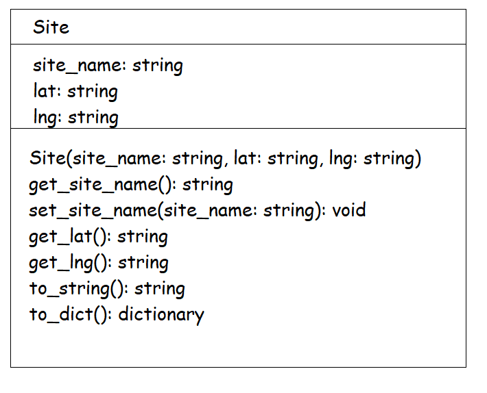

# Assignment 4 - Weather

## Setup

Create a new project folder called `a4`.  You will need to add the contents of [this](a4.zip) ZIP file into the project.

## Q1 - Sites

1.  Provide the code in the Python program `sites.py` to print each site name and the number of sites as shown in demo video.

1.  Provide the code in `sites2html.py` to create a file `sites.html` showing all sites and map link as shown in demo video.  Use this URL format for map coordinates - `https://www.google.com/maps/@55.043,-7.40632,15z`

1.  Provide the code in `site_finder.py` to allow the user to enter a road number and then show sites on that road.  See the demo video.

1.  Provide the code in `Site.py` that implements the `Site` class as shown in the class diagram.

    

2.  Test you've implemented the `Site` class correctly by running `SiteTester.py`

3.  Provide the code in `siteObjects.py` to read each site from `sites.json`, create a site object and print a string representation of each site object.  See the demo video.

4.  Provide the code in `siteUpdate.py` to update a given site name and write update to `sites.json`.  You must use the `Site` class function `set_site_name()` in your solution.  See the demo video.

## Q2 - Weather

1.  Provide the code in the Python program `weatherByDate.py` to get a valid date (yyyy-mm-dd) from the user and then print all the weather data for that date.  If a blank date in input assume the date is today.  See [here](https://www.w3schools.com/python/python_datetime.asp) for useful date functions.  See the demo video.

1.  Provide the code in `weatherTodayAt.py` to allow the user to enter a site name and then show today's weather data for that location.  See the demo video.

1.  Provide the code in `weatherStats.py` to print overall weather statistics.  See the demo video.

1.  Provide the code in `weatherTodaySortedBy.py` to allow the user to view today's weather data sorted by a chosen weather value.  See the demo video.

## Submission Details

The deadline for electronic submissions is **noon Friday 3rd May 2024**. Submit your code via the link on BlackBoard.

Submit your Assignment Cover Sheet during any lab before the end of semester.

### A note on plagiarism and cheating

If any of the code submitted by you is deemed copied from or by someone else it will be formally reported to the Head of School of Science and a Disciplinary Committee will be convened to deal with this issue. You do not want that to happen!!

Never copy code from someone else or another source. Never give your code to someone else. Keep your code safely in your own possession. Plagiarism and cheating are very serious academic offenses with serious consequences for your future academic studies and work opportunities. Under current guidelines all students involved in plagiarism or cheating must be reported to the Head of School where a Disciplinary Committee will deal with the issue.

Final grades are subject to a code review of your solutions.  A code review will include checks for the following:  
- readability 
- duplication of code 
- variable naming 
- code performance 
- authenticity 
- hard coding 
- etc. 

