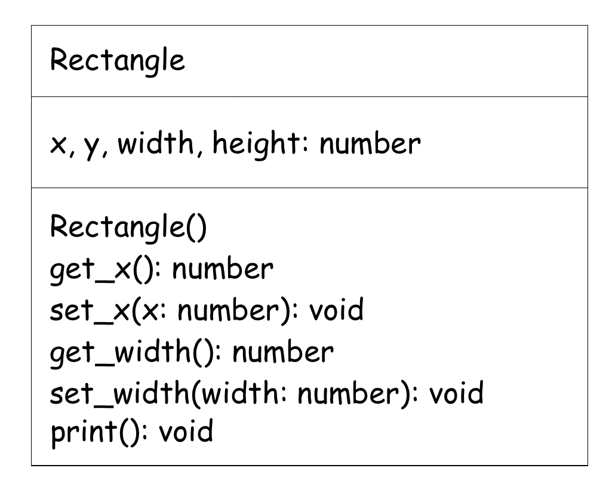
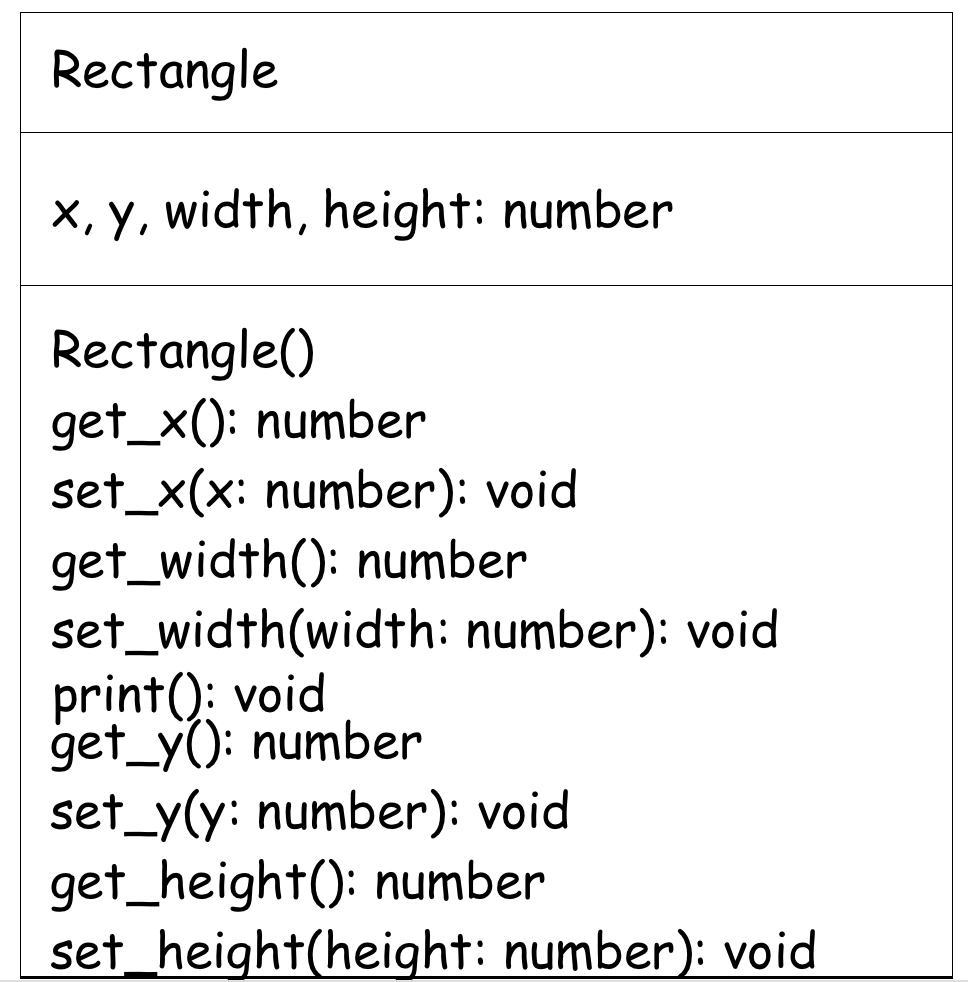

# Python Exercise 9

# Lab #1 - Exercise 1

1. Open your Pycharm project `Python2024` from your main `python` folder.

1. Create a new weekly project folder called `Ex9` -  (<kbd>File</kbd> ... <kbd>New...</kbd> ... <kbd>Directory</kbd>):

## Part 1 - OOP 

1.  In your `Ex9` folder create a Python program called `author.py` with the following code:

    ```python
    class Author:
        def __init__(self, name):
            self.name = name

        def get_name(self):
            return self.name

    author1 = Author("JK Rowling")
    print(author1.get_name())
    author2 = Author("D Walliams")
    print(author2.get_name())
    ```  
    
    Execute the code.  
    
    Create a third object called `author3`, initialise with your name and print it.

1.  In your `Ex9` folder create a Python program called `person.py` with the following code:

    ```python
    class Person:
        def __init__(self, name, age):
            self.name = name
            self.age = age

        def print(self):
            print(f"name = {self.name}; age = {self.age}")

    person1 = Person("John", 21)
    person1.print()
    ```

    Execute the code. 
    
2.  Update `person.py` to include the following additional code:

    ```python
    class Person:
        def __init__(self, name, age):
            self.name = name
            self.age = age

        def print(self):
            print(f"name = {self.name}; age = {self.age}")

        def get_name(self):
            return self.name

        def set_name(self, name):
            self.name = name

    person1 = Person("John", 21)
    person1.print()
    person1.set_name("Bob")
    person1.print()
    print(person1.get_name())
    ```

    Execute & understand the code. 

1.  Update `person.py` to include 2 new class functions

    - `get_age()`  - return `age` variable
    - `set_age()`  - updates/changes `age` variable


    Test these new functions work with these statements:

    ```python
    ...
    ...
    ...

    person1 = Person("John", 21)
    person1.print()
    person1.set_age(22)
    print(person1.get_age())
    person1.print()    
    ```

    Expected output:
    ```
    name = John; age = 21
    22
    name = John; age = 22
    ```


2.  Create a Python program called `rectangle.py` with the following basic code:    
    
    ```python
    class Rectangle:
        def __init__(self):
            self.x = 0
            self.y = 0
            self.width = 0
            self.height = 0

        def get_x(self):
            return self.x

        def set_x(self, x):
            self.x = x

        def get_width(self):
            return self.width

        def set_width(self, width):
            self.width = width

        def print(self):
            return f"[x = {self.x}; y = {self.y}; width={self.width}; height={self.height}]"


    rectangle = Rectangle()
    rectangle.set_x(15)
    rectangle.set_width(20)
    print(rectangle.print())
    ```  

    This class diagram depicts the code given:

    

    - a class called `Rectangle`
    - class variables - `x`, `y`, `width`, `height`
    - a constructor
    - 2 get class functions
    - 2 set class functions
    - a `print()` function that prints state of the class
  
    Execute and understand the code.

1.  Modify the code in `rectangle.py` to include get and set functions for `y` and `height` as depicted here:

    

    The following update to the code should work:

    ```python
    rectangle = Rectangle()
    rectangle.set_x(15)
    rectangle.set_y(35)
    rectangle.set_width(20)
    rectangle.set_height(30)
    print(rectangle.print())
    ```

    Expected output:
    ```
    [x = 15; y = 35; width=20; height=30]
    ```

1.  Create 2 new functions `perimeter()` and `area()` to calculate the perimeter and area of the rectangle.

    The following update to the code should work:

    ```python
    rectangle = Rectangle()
    rectangle.set_x(15)
    rectangle.set_y(35)
    rectangle.set_width(20)
    rectangle.set_height(30)
    print(rectangle.print())
    print(f"Perimeter = {rectangle.perimeter()}")
    print(f"Area = {rectangle.area()}")
    ```

    Expected output:
    ```
    [x = 15; y = 35; width=20; height=30]
    Perimeter = 100
    Area = 600
    ```

1.  Modify the code so the `x`, `y`, `width` and `height` values can be passed as arguments to the class constructor, e.g.

    ```python
    ...
    rectangle = Rectangle(15, 35, 20, 30)
    # rectangle.set_x(15)
    # rectangle.set_y(35)
    # rectangle.set_width(20)
    # rectangle.set_height(30)
    print(rectangle.print())
    print(f"Perimeter = {rectangle.perimeter()}")
    print(f"Area = {rectangle.area()}")
    ```

    Expected output:
    ```
    [x = 15; y = 35; width=20; height=30]
    Perimeter = 100
    Area = 600
    ```

# Lab #2 - Exercise 2

1.  In your `Ex9` folder create a new class module (file) called `Movie.py` with this code:

    ```python 
    class Movie:
        def __init__(self, title, year):
            self.title = title
            self.year = year

        def get_title(self):
            return self.title

        def get_year(self):
            return self.year

        def to_string(self):
            return f"[Movie: title = ?????, year = ?????]"

        def to_dict(self):
            return "will return a dictionary using dict() function for the class variables"
    ```

1.  In your `Ex9` folder create a new program called `use_movie.py` that:
    -   imports the ``Movie`` class
    -   creates a ``movie`` object with the title *Gladiator* and year *2000*
    -   prints both the string representation and dictionary representation of the object.  Your code should output:

        ```
        [Movie: title = Gladiator, year = 2000]
        {'title': 'Gladiator', 'year': 2000}
        ```

        You'll have to mofify the ``to_string()`` and ``to_dict()`` functions in the ``Movie`` class.

1.  Modify `use_movie.py` so the ``movie`` object dictionary is written to a JSON file called ``movie.json``.  Your ``movie.json`` file should have the following content when done:

    ``movie.json``
    ```json
    {
        "title": "Gladiator",
        "year": 2000
    }
    ```

